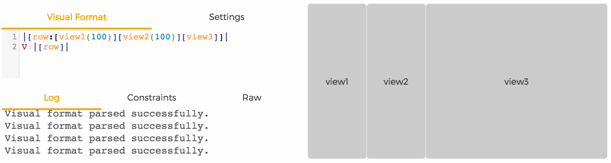
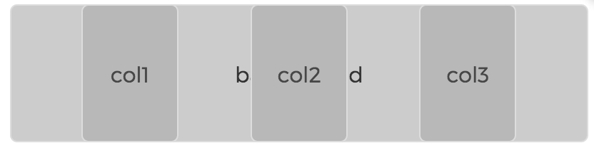

[](https://www.npmjs.org/package/famous-autolayout)
[](http://doge.mit-license.org)

famous-autolayout
==========

famous-autolayout implements Apple's Auto-layout Visual Format Language (VFL) for famo.us. Auto layout is a system which lets you perform lay out using mathematical relationships (constraints). Using (E)VFL you can create complex responsive layouts in no time:



## Index

- [Important resources](#important-resources)
- [Getting started](#getting-started)
- [Spacing](#spacing)
- [Viewport settings](#viewport-settings)
- [Z-ordering](#z-ordering)
- [Using the size of the render-node](#using-the-size-of-the-render-node)

## Important resources

Before you get started with famous-autolayout and VFL, it is important to know about these resources:

- [Apple's visual format language](https://developer.apple.com/library/ios/documentation/UserExperience/Conceptual/AutolayoutPG/VisualFormatLanguage/VisualFormatLanguage.html)

*This article describes the basics of autolayouts visual format language and should be your starting point in getting acquainted with famous-autolayout. The basic concepts are simple but it does require a certain way of thinking. I suggest taking the time to learn and understand the concepts properly and you will be rewarded generously afterwards.*

- [Extended Visual Format Language (EVFL)](https://github.com/IjzerenHein/autolayout.js#extended-visual-format-language-evfl)

*The Extended Visual Format Language is a superset of VFL that has been created to solve limitations in standard VFL as well as give you greater control of layouts with less code. Amongst other things, it adds 'z-ordering' which is essential when using VFL with famo.us. Famous-autolayout uses EVFL.*

- [Supported meta info](https://github.com/IjzerenHein/visualformat-editor#extended-visual-format-meta-info)

*In the comments of your VFL you can specify meta information which is used by the renderer of the layout. You can use this to for instance set the default spacing or aspect-ratio of the view.*

- [Visual format Editor](https://rawgit.com/IjzerenHein/visualformat-editor/master/dist/index.html) ([github repo](https://github.com/IjzerenHein/visualformat-editor))

*The Visual format editor is an essential resource when working with VFL layouts. It allows you to edit and preview layouts and contains syntax checking and highlighting. In development, this will be your friend that immediately shows results and allows you to test the responsiveness of your layouts (just resize the browser!).*

## Getting started

To use AutoLayout in your famo.us project, install famous-autolayout using npm or bower:

    npm install famous-autolayout

    bower install famous-autolayout

## Famo.us Mixed Mode

*Autolayout for famo.us Mixed Mode is under development, check back later.*


## Famo.us v0.3.x

To use auto-layout with famo.us v0.3.x, install famous-flex:

    npm install famous-flex

    bower install famous-flex

To create a layout from a visual format, use:

```javascript
var LayoutController = require('famous-flex/LayoutController');
var vflToLayout = require('famous-autolayout/src/vflToLayoutv3');

var layoutController = new LayoutController({
    layout: vflToLayout([
        '//spacing:10',
        '//heights footer:100',
        'V:|[col:[header(100)]-[content]-[footer]]|',
        'H:|[col]|'
    ]),
    dataSource: {
        header: new Surface({..}),
        content: new Surface({..}),
        footer: new Surface({..})
    }
});
this.add(layoutController); // add layout-controller to render-tree
```

Any settings that can be configured in the VFL comments, can also
be configured through the layout-options:

```javascript
var layoutController = new LayoutController({
    layout: vflToLayout([
        'V:|[col:[header(100)][content][footer]]|',
        'H:|[col]|'
    ]),
    layoutOptions: {
        spacing: 10,
        heights: {
            footer: 100
        }
    },
    dataSource: {...}
});
```


## Viewport settings

By default the layout is sized to the full width and height of its parent.
Using the `viewport` directive, additional rules such as aspect-ratio or max-height can be defined:

```vfl
//viewport aspect-ratio:16/9 max-height:500 width:100
|[row:[view1(view2)][view2]]|
V:|[row]|
```

[Check out this example online](https://rawgit.com/IjzerenHein/visualformat-editor/master/dist/index.html?vfl=rgb)

It is also possible to use the size as calculated by the layout itself:

```vfl
//viewport width:intrinsic height:intrinsic
|[view1(300)]|
V:|[view1(200)]|
```


## Spacing

Spacers are defined in VFL using the dash-symbol, like this:

    H:|-10-[view1(100)]-5%-[view2]-|
    
Spacers can either have a fixed (`-10-`), proportional (`-5%-`) or a default size (`-`).
The default spacing is set to `8`. To change the default spacing, use the `spacing` directive in the comments of the VFL:

```vfl
//spacing: 50
H:|-[view1(100)]-[view2]-|
V:|[view1]|
V:|[view2]|
```


## Z-ordering

In famo.us, the z-ordering is important to indicate which node overlaps other nodes.
This becomes apparent when you create a layout that has a background and foreground nodes:

```vfl
//spacing:50
H:|[background]|
V:|[background]|
H:|[row:-[col1(col2,col3)]-[col2]-[col3]-]|
V:|[row]|
Z:|[background][row] // put row in front of the background
```


The last line of VFL instructs the layout that `[row]` is in front of `[background]`.


## Using the size of the render-node (true-size)

Sometimes you want the render-node to calculate the size (e.g. a text that has a variable width based
its content), rather than defining it in VFL.
To do this, set the width or height to `intrinsic` in the VFL comments. This instructs the `vflToLayout`
function to grab the size from the node and pass it along to the autolayout solver.

```vfl
//widths text1:intrinsic text2:intrinsic
H:|-[text1]-[longText2]
V:|[text1]|
V:|[longText2]|
```


## Contribute

If you like this project and want to support it, show some love
and give it a star.


## Contact
-   @IjzerenHein
-   http://www.gloey.nl
-   hrutjes@gmail.com

© 2015 Hein Rutjes
